# Hello, I'm Emrul Kayes! 👋

With over **9 years of full-stack experience** at Cefalo, I specialize in creating robust applications utilizing modern technologies. My expertise lies in **ASP.NET Core, Razor, Blazor, Angular,** and **React**, and I’m passionate about applying architectural patterns like **Modular Monolith, Domain-Driven Design (DDD),** and **Event-Driven Architecture (EDA)**.

## What I Do

I develop, design, and maintain scalable web applications that prioritize user experience and performance. My approach ensures that software solutions are not only functional but also maintainable and adaptable to changing needs.

## Tech Stack

- **Frontend:** Angular, React, Blazor
- **Backend:** ASP.NET Core
- **Architectural Patterns:** Modular Monolith, DDD, EDA

### Github Status

