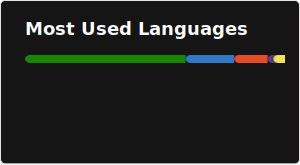
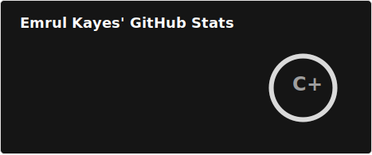

# Hello, I'm Emrul Kayes! 👋

**Staff Software Engineer** with **10 years in the C# / .NET ecosystem** — I design and run the backend systems behind banking, payments, microfinance, and real-time trading platforms. Currently at **Cefalo**, leading a team building payment solutions for Nordic clients.

🌐 **Portfolio: [mdemrulkayes.github.io](https://mdemrulkayes.github.io)**

## What I Do

- Design **ASP.NET Core APIs and microservices** that stay reliable under real production load
- Architect systems around **Clean Architecture, DDD, Event-Driven Design, and Modular Monoliths**
- Build identity from the ground up — **OAuth2, OpenID Connect, IdentityServer4, SSO**
- Keep delivery smooth with **Azure, CI/CD pipelines, and GitHub Actions**

## Tech Stack

- **Backend:** C#, ASP.NET Core, Web API, Blazor (Server/WASM), EF Core, Dapper, SignalR, NestJS
- **Architecture:** Microservices, Modular Monolith, Clean Architecture, DDD, EDA, CQRS/MediatR
- **Cloud & DevOps:** Azure (Functions, AD, Storage, Key Vault), Azure DevOps, GitHub Actions, Kafka, ELK
- **Databases:** MSSQL, PostgreSQL, MySQL, EventStore DB, Redis
- **Frontend:** Angular, React, NextJS, TypeScript

  
  
  

## GitHub Statistics

